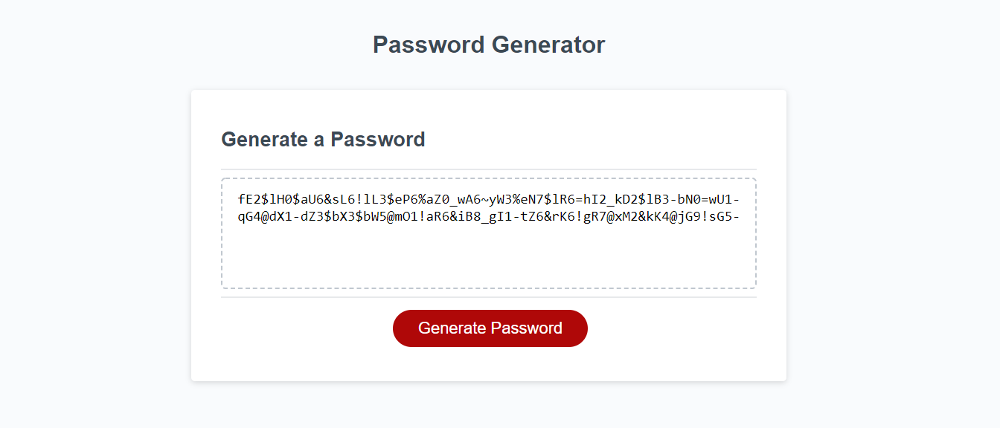

# Password Generator
The purpose of this project is to provide end users/employees a way to produce new, more secure passwords. The password will be random and based on some selections.

**Created**: `2020 September 24`
 
Deployed at: https://charlinelach.github.io/pwGenerator/
 
Repository: https://github.com/charlinelach/pwGenerator

# Development

## Usage Instructions
To utilize this application, users may access it via the [deploy link](https://charlinelach.github.io/pwGenerator/). On this application, several questions will be asked:
1. How many characters are sought?
2. Is the use of lowercase letters wanted?
3. Is the use of uppercase letters wanted?
4. Is the use of numbers wanted?
5. Is the use of special characters wanted?

## Installation Instructions
N/A

## Credits & Thank Yous
Again, the classmates deserve a lot of credit for asking questions and receiving answers before I ever faced them. This has helped me create the application faster than otherwise.
 
Huge shout out to the instructor and TAs for answering questions in office hours, class, lunch, and more!

# License Information
N/A
